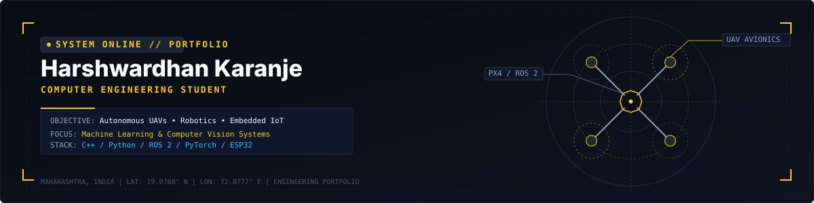

<div align="center">
  
</div>

<br/>

<div align="center">

[](https://github.com/harshkaranje07)&nbsp;
[](https://linkedin.com/in/harshwardhankaranje)&nbsp;
[](https://my-portfolio-seven-henna-92.vercel.app)&nbsp;
[](mailto:harshwardhankaranje@gmail.com)

</div>

<br/>
<br/>

---

### About

Computer Engineering student building systems at the intersection of autonomous hardware and applied intelligence. My focus is on embedded flight controllers, computer vision pipelines, and real-time software — the kind of engineering that has to work in the field.

I am interested in full-time opportunities, internships, and technical collaborations in **robotics**, **autonomous systems**, and **embedded AI**.

---

<br/>

### Engineering Interests

<br/>

<table>
<tr>
<td width="33%" align="center" valign="top">
<br/>

**UAV & Avionics**

Autonomous flight systems, flight controller firmware, MAVLink telemetry, mission planning

</td>
<td width="33%" align="center" valign="top">
<br/>

**Embedded Systems**

Real-time firmware, RTOS, sensor fusion, ESP32 / STM32 microcontrollers, IoT pipelines

</td>
<td width="33%" align="center" valign="top">
<br/>

**Artificial Intelligence**

Computer vision, gesture recognition, object detection, edge inference, deep learning

</td>
</tr>
<tr>
<td width="33%" align="center" valign="top">
<br/>

**Robotics**

ROS 2, path planning, SLAM, sensor integration, autonomous navigation

</td>
<td width="33%" align="center" valign="top">
<br/>

**Full-Stack Engineering**

Web applications, REST APIs, real-time telemetry dashboards, systems integration

</td>
<td width="33%" align="center" valign="top">
<br/>

**Flight Control**

PX4, ArduPilot, Offboard control, Gazebo simulation, quadcopter dynamics

</td>
</tr>
</table>

<br/>

---

<br/>

### Technical Stack

<br/>

<table width="100%">
<tr>
<td width="33%" valign="top">

**Programming**


</td>
<td width="33%" valign="top">

**UAV & Robotics**


</td>
<td width="33%" valign="top">

**Embedded & IoT**


</td>
</tr>
<tr>
<td width="33%" valign="top">

**AI & Machine Learning**


</td>
<td width="33%" valign="top">

**Web Development**


</td>
<td width="33%" valign="top">

**Tools**


</td>
</tr>
</table>

<br/>

---

<br/>

### Currently Building

<br/>

```
  Autonomous UAV Platform       ROS 2 Nav2 · PX4 Offboard · LiDAR SLAM · Collision Avoidance
  Edge AI Vision Engine         YOLOv8 · TensorRT · ESP32-S3 · Real-time Object Tracking
  Embedded Telemetry Hub        FreeRTOS · MQTT · Sensor Fusion · Ground Station Interface
  Engineering Portfolio         Next.js · Vercel · Live at my-portfolio-seven-henna-92.vercel.app
```

<br/>

---

<br/>

### GitHub Statistics

<br/>

<div align="center">
  
  &nbsp;
  
</div>

<br/>

<div align="center">
  
</div>

<br/>

---

<br/>

### Featured Projects

<br/>

**UAV & Autonomous Systems**

<table width="100%">
<tr>
<td width="72%" valign="middle">

[**AeroPulse**](https://github.com/harshkaranje07/aeropulse) &nbsp;—&nbsp; Hand gesture recognition system for aerospace drone teleoperation with a custom HUD overlay. Translates real-time hand landmarks into flight commands over MAVLink.

`Python` &nbsp; `MediaPipe` &nbsp; `OpenCV` &nbsp; `MAVLink` &nbsp; `Physics Simulation`

</td>
<td width="28%" align="right" valign="middle">

[](https://github.com/harshkaranje07/aeropulse)

</td>
</tr>
</table>

<br/>

**Web Development**

<table width="100%">
<tr>
<td width="72%" valign="middle">

[**IEN Engineering Club**](https://github.com/harshkaranje07/ien-club) &nbsp;—&nbsp; Official web platform for the IEN Club with member management, event tracking, and admin dashboard.

`TypeScript` &nbsp; `Next.js` &nbsp; `React`

</td>
<td width="28%" align="right" valign="middle">

[](https://github.com/harshkaranje07/ien-club)

</td>
</tr>
<tr><td colspan="2"><br/></td></tr>
<tr>
<td width="72%" valign="middle">

[**Research Project System**](https://github.com/harshkaranje07/research-project-system) &nbsp;—&nbsp; Full-stack web application for managing and submitting academic research projects.

`JavaScript` &nbsp; `Node.js`

</td>
<td width="28%" align="right" valign="middle">

[](https://github.com/harshkaranje07/research-project-system)

</td>
</tr>
<tr><td colspan="2"><br/></td></tr>
<tr>
<td width="72%" valign="middle">

[**Engineering Portfolio**](https://github.com/harshkaranje07/my_portfolio) &nbsp;—&nbsp; Personal portfolio website. &nbsp;[Live ↗](https://my-portfolio-seven-henna-92.vercel.app)

`JavaScript` &nbsp; `Vercel`

</td>
<td width="28%" align="right" valign="middle">

[](https://my-portfolio-seven-henna-92.vercel.app)

</td>
</tr>
</table>

<br/>

**Algorithms & Systems**

<table width="100%">
<tr>
<td width="72%" valign="middle">

[**DSA Programs**](https://github.com/harshkaranje07/DSAprograms) &nbsp;—&nbsp; Curated data structures and algorithm implementations covering core competitive programming patterns.

`C++`

</td>
<td width="28%" align="right" valign="middle">

[](https://github.com/harshkaranje07/DSAprograms)

</td>
</tr>
</table>

<br/>

---

<br/>

### Contribution Activity

<br/>

<div align="center">
  
</div>

<br/>

---

<br/>

### Connect

<br/>

I am open to internships, research collaborations, and engineering roles in robotics, autonomous systems, embedded AI, and UAV development.

<br/>

<div align="center">

[](https://github.com/harshkaranje07)&nbsp;
[](https://linkedin.com/in/harshwardhankaranje)&nbsp;
[](https://my-portfolio-seven-henna-92.vercel.app)&nbsp;
[](mailto:harshwardhankaranje@gmail.com)

</div>

<br/>
<br/>

<div align="center">
  <sub>Computer Engineering &nbsp;·&nbsp; Pune, India &nbsp;·&nbsp; Open to opportunities</sub>
</div>
